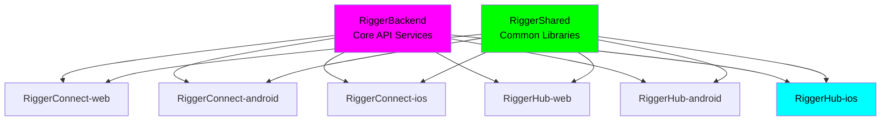
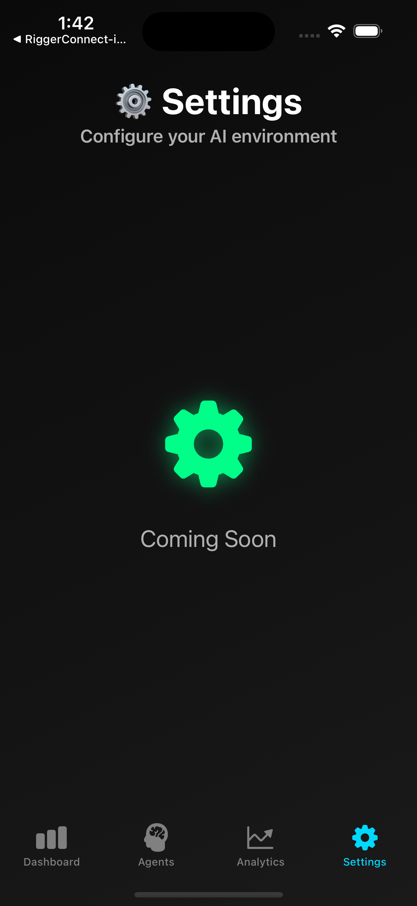
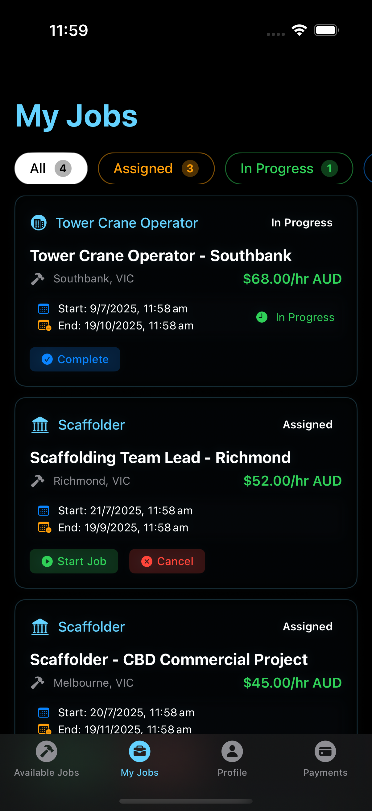
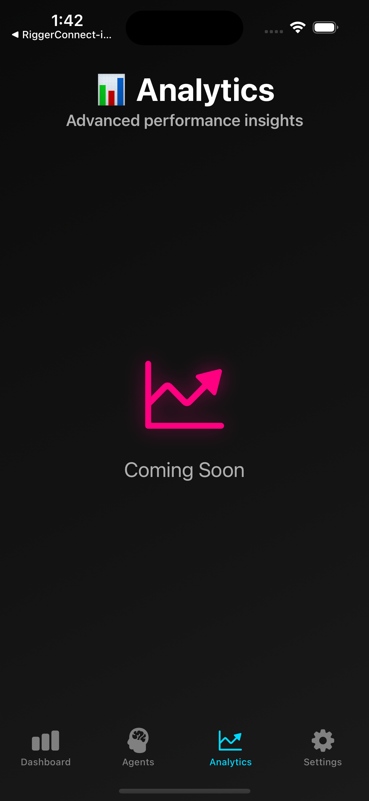
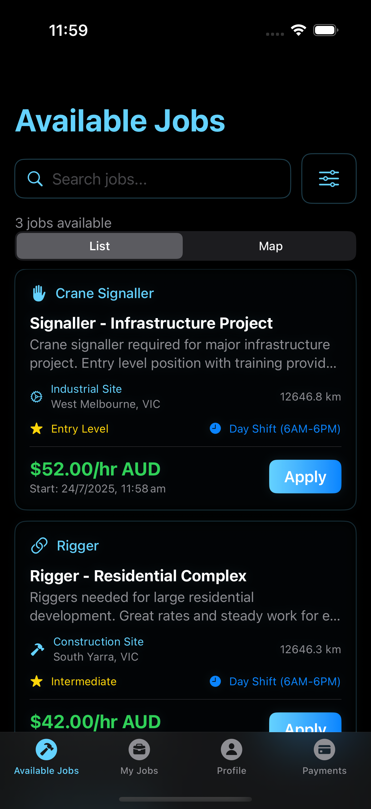
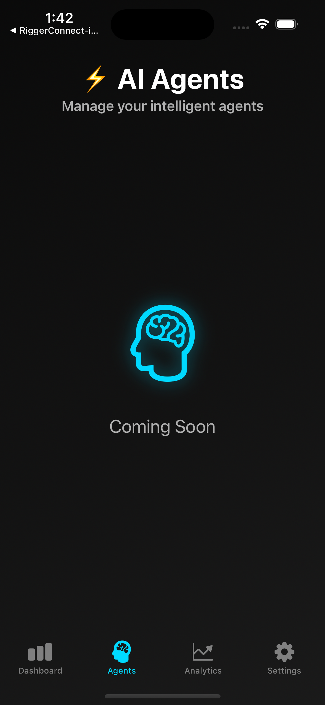
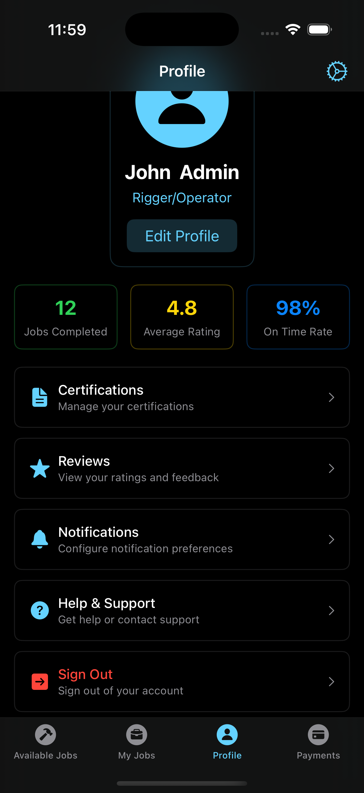

# RiggerHub iOS

🏗️ **A ChaseWhiteRabbit NGO Initiative**

## 📍 Repository Location \u0026 Structure\n\n**Current Location**: `/Users/tiaastor/Github/tiation-repos/RiggerHub-ios/`\n\nThis repository is part of the **Tiation Enterprise Repository Structure**, specifically designed to house **ChaseWhiteRabbit NGO's** technology initiatives following enterprise-grade development practices.\n\n### 🏗️ Enterprise Ecosystem\n- **Repository Collection**: [Enterprise Repository Index](../ENTERPRISE_REPOSITORY_INDEX.md)\n- **Web Platform**: [RiggerHub-web](../RiggerHub-web/)\n- **Android Companion**: [RiggerHub-android](../RiggerHub-android/)\n- **Connect Platform**: [RiggerConnect-web](../RiggerConnect-web/), [RiggerConnect-android](../RiggerConnect-android/), [RiggerConnect-ios](../RiggerConnect-ios/)\n- **Backend Services**: [RiggerBackend](../RiggerBackend/)\n- **Shared Libraries**: [RiggerShared](../RiggerShared/)\n\n### 🌟 NGO Integration\nAs a **ChaseWhiteRabbit NGO Initiative**, this project adheres to:\n- ✅ **Enterprise-grade development practices**\n- ✅ **Ethical technology standards**\n- ✅ **Worker empowerment focus**\n- ✅ **DevOps best practices with CI/CD**\n- ✅ **Open development transparency**\n\n## 🎯 Application Overview\n\nRiggerHub iOS is a comprehensive mobile solution designed for the management and coordination of rigger operations across various sectors, including construction, oil & gas, and heavy machinery industries in Western Australia. Our iOS app empowers operators and teams to efficiently execute strategic plans with real-time management tools.

## 🎯 Project Purpose

Aligned with ChaseWhiteRabbit NGO's mission to harness technology for greater good, RiggerHub iOS encapsulates our commitment to: 

- **Facilitating** seamless project tasks 6 employee collaboration
- **Enhancing** operational safety and compliance
- **Empowering** users with robust analytics and performance monitoring tools

## 🔗 Related Repositories

### Core Platform Components

| Repository | Platform | Description | GitHub SSH URL |
|------------|----------|-------------|----------------|
| **RiggerConnect-web** | Web | Business-focused recruitment platform | `git@github.com:tiation/RiggerConnect-web.git` |
| **RiggerConnect-android** | Android | Mobile business management app | `git@github.com:tiation/RiggerConnect-android.git` |
| **RiggerConnect-ios** | iOS | Mobile business management app | `git@github.com:tiation/RiggerConnect-ios.git` |
| **RiggerConnect-capacitor** | Cross-platform | Cross-platform mobile framework | `git@github.com:tiation/RiggerConnect-capacitor.git` |
| **RiggerHub-web** | Web | Worker-focused job search platform | `git@github.com:tiation/RiggerHub-web.git` |
| **RiggerHub-android** | Android | Mobile worker app | `git@github.com:tiation/RiggerHub-android.git` |
| **RiggerHub-ios** | iOS | Mobile worker app | `git@github.com:tiation/RiggerHub-ios.git` |
| **RiggerBackend** | API/Backend | Core backend services and APIs | `git@github.com:tiation/RiggerBackend.git` |
| **RiggerShared** | Multi-platform | Shared libraries and components | `git@github.com:tiation/RiggerShared.git` |

### Enterprise Integration Architecture



### ChaseWhiteRabbit NGO License Framework

All repositories in the Rigger ecosystem are licensed under **GPL v3**, ensuring:
- ✅ **Open Source Transparency**: Complete code visibility and community auditing
- ✅ **Ethical Technology Standards**: Algorithmic fairness and bias prevention
- ✅ **Worker Empowerment Focus**: Technology serving users, not corporate profits
- ✅ **Community Ownership**: Improvements benefit the entire rigger community
- ✅ **Corporate Responsibility**: Commercial use must remain open and accessible

## 🚀 Technology Stack

- **Language**: Swift 5.9+
- **UI Framework**: SwiftUI
- **Architecture**: MVVM with Combine
- **Minimum iOS Version**: iOS 15

## Overview


## 🏗️ Overview

RiggerHireApp is an enterprise-grade B2B platform revolutionizing recruitment in Western Australia's construction and mining industries. Our platform seamlessly connects businesses with certified riggers, doggers, and crane operators while ensuring strict compliance with WorkSafe WA standards.

## 🎯 Key Benefits

- **Safety First**: Automated WorkSafe WA compliance verification
- **Efficiency**: AI-powered matching system
- **Reliability**: Real-time worker availability tracking
- **Security**: Enterprise-grade data protection
- **Compliance**: Automated certification verification
- **Accessibility**: WCAG 2.1 compliant interface

## 🚀 Features

### Core Capabilities
- Enterprise-grade safety compliance system
- AI-powered worker-job matching
- Real-time availability tracking
- Secure payment processing (Stripe & Supabase)
- Mobile-first responsive design
- Automated certification verification

### Business Features
- Comprehensive worker verification
- Automated compliance checking
- Real-time availability updates
- Secure payment processing
- Analytics dashboard
- Automated reporting

### Worker Features
- Digital certification management
- Real-time job notifications
- Secure document storage
- Payment tracking
- Professional profile builder
- Skills verification

## 🏢 Repository Structure

```
RiggerHireApp/
├── android/           # Android mobile app
├── ios/              # iOS mobile app
├── B2B-web/          # Business client web interface
├── Staff-web/        # Staff management portal
├── backend/          # Core backend services
├── services/         # Microservices
├── docs/             # Documentation
├── testing/          # Test suites
└── infrastructure/   # DevOps and deployment
```

## 🛠️ Tech Stack

- Mobile: Swift (iOS), Kotlin (Android)
- Web: TypeScript, React
- Backend: Node.js, TypeScript
- Database: PostgreSQL, Redis
- Infrastructure: Docker, Kubernetes
- Payment Processing: Stripe, Supabase

## 📱 Screenshots

### Mobile-Responsive Design

Our enterprise-grade platform features a dark neon theme with cyan/magenta gradients, optimized for all screen sizes:

#### Business Dashboard




#### Worker Profile




#### Job Listings




## 🔧 Development Setup

[Documentation in Progress]

## 📄 Documentation

- [API Documentation](./docs/api/README.md)
- [Architecture Overview](./docs/architecture/README.md)
- [Deployment Guide](./docs/deployment/README.md)

## 🤝 Contributing

[Guidelines in Progress]

## 🤝 Project Team & Purpose

This project is part of a broader suite of repositories aimed at supporting the **transient rigging and heavy lifting industry** in Western Australia and beyond.

🔗 **Related Repositories**:

* [`RiggerConnect-web`](https://github.com/ChaseWhiteRabbit/RiggerConnect-web) - Professional networking platform for construction workers
* [`RiggerConnect-android`](https://github.com/ChaseWhiteRabbit/RiggerConnect-android) - Native Android mobile networking application
* [`RiggerConnect-ios`](https://github.com/ChaseWhiteRabbit/RiggerConnect-ios) - Native iOS mobile networking application
* [`RiggerConnect-capacitor`](https://github.com/ChaseWhiteRabbit/RiggerConnect-capacitor) - Cross-platform mobile app built with Ionic Capacitor
* [`RiggerHub-web`](https://github.com/ChaseWhiteRabbit/RiggerHub-web) - Operations management hub for business users
* [`RiggerHub-android`](https://github.com/ChaseWhiteRabbit/RiggerHub-android) - Native Android operations management application
* [`RiggerHub-ios`](https://github.com/ChaseWhiteRabbit/RiggerHub-ios) - Native iOS operations management application
* [`RiggerShared`](https://github.com/ChaseWhiteRabbit/RiggerShared) - Shared libraries, components, and utilities
* [`RiggerBackend`](https://github.com/ChaseWhiteRabbit/RiggerBackend) - Core backend services and APIs for the Rigger ecosystem

📬 **Contact**:
For questions, ideas, or collaboration inquiries, please reach out to:

* **Jack Jonas** – [jackjonas95@gmail.com](mailto:jackjonas95@gmail.com)
* **Tia** – [tiatheone@protonmail.com](mailto:tiatheone@protonmail.com)

---

### 🙌 About the Founders

**Jack Jonas** is a seasoned rigger, crane operator, and heavy vehicle mechanic based in Karratha, Western Australia. His firsthand experience in the field shapes the practical backbone of this platform.

**Tia** is a Swedish software developer and founder of the NGO **ChaseWhiteRabbit**, which is dedicated to building inclusive, systemic solutions to complex challenges.

Together, they created this SaaS platform to:

* Help connect riggers, doggers, and crane operators to real work opportunities.
* Support better logistics, transparency, and compliance in the field.
* Fund and sustain the good work being done by **ChaseWhiteRabbit** in disadvantaged communities.

## 👥 Contact & Team

### Project Leaders

**Jack Jonas** - Karratha Crane Operator & Industry Expert  
📧 [jackjonas95@gmail.com](mailto:jackjonas95@gmail.com)  
🏗️ **Industry Expertise**: Seasoned rigger, crane operator, and heavy vehicle mechanic based in Karratha, Western Australia. Jack's comprehensive understanding of rigger operations across various sectors ensures this iOS application provides the real-time management tools and strategic planning capabilities needed for efficient execution of complex industrial projects.

**Tia** - ChaseWhiteRabbit NGO Technical Leadership  
📧 [tiatheone@protonmail.com](mailto:tiatheone@protonmail.com)  
🌟 **NGO Mission-Driven Leadership**: Swedish software developer and founder of ChaseWhiteRabbit NGO, aligned with the mission to harness technology for greater good. Tia's commitment to facilitating seamless project tasks and enhancing operational safety drives the development of robust analytics and performance monitoring tools that empower rigger teams.

### Primary Maintainers

For inquiries related to the Rigger ecosystem, please contact our primary maintainers:

- **Jack Jonas**: [jackjonas95@gmail.com](mailto:jackjonas95@gmail.com)
- **Tia Astor**: [tiatheone@protonmail.com](mailto:tiatheone@protonmail.com)

These maintainers oversee the development and coordination of the entire Rigger platform ecosystem, including RiggerConnect, RiggerHub, RiggerBackend, and RiggerShared repositories.

## 🌟 Project Vision: Empowering Industry Through Ethical Technology

### How This Platform Serves Jack Jonas and the Rigging Industry

RiggerHub iOS delivers comprehensive mobile solutions designed for the sophisticated requirements of Western Australia's rigging operations management. For experienced professionals like Jack Jonas overseeing complex industrial projects, this iOS application provides:

- **Native iOS Operations Excellence**: Advanced iOS app leveraging native capabilities for seamless project tasks and employee collaboration in demanding industrial environments
- **Strategic Planning Tools**: Sophisticated iOS interface enabling real-time management and strategic planning for complex rigging operations
- **Enhanced Operational Safety**: iOS-native safety compliance monitoring and real-time alerts ensuring adherence to WA safety standards
- **Performance Analytics Integration**: Robust analytics and performance monitoring tools that provide comprehensive insights into operational efficiency and team performance
- **Seamless Team Collaboration**: Advanced iOS collaboration features facilitating communication and coordination among rigger teams across multiple project sites

### Supporting ChaseWhiteRabbit NGO's Charitable Mission

Every successful operation managed through RiggerHub iOS generates sustainable funding for ChaseWhiteRabbit NGO's charitable initiatives:

- **iOS Platform Impact**: Revenue from premium iOS operations management features directly supports NGO programs focused on workforce development and community empowerment
- **Strategic Planning Success**: Platform effectiveness in enabling strategic operations planning funds NGO investment in vocational training programs for disadvantaged communities
- **Safety and Compliance Revenue**: iOS app success in enhancing operational safety helps establish safety training centers in remote industrial communities
- **Technology Innovation**: Platform growth supports NGO research and development of additional open-source tools that benefit operations management across blue-collar industries
- **Industry Excellence Advocacy**: Revenue funds research and policy development for improved operational standards and worker empowerment in industrial sectors

### Ethical, Accessible, and Worker-First Technology

RiggerHub iOS exemplifies ChaseWhiteRabbit NGO's commitment to harnessing technology for greater good:

**🔍 Ethical by Design**
- GPL v3 licensing ensures complete transparency and prevents proprietary exploitation of operational and performance data
- Algorithmic fairness in resource allocation and performance evaluation prevents discrimination and promotes equal opportunity
- Privacy-first architecture using iOS security frameworks to protect sensitive operational information
- Anti-bias safeguards in analytics and performance monitoring ensure fair evaluation regardless of worker background

**♿ Accessibility as a Core Value**
- Full iOS accessibility support including VoiceOver, Dynamic Type, and Switch Control compatibility for users with diverse abilities
- Multi-language support reflecting the diverse workforce communities in WA's industrial sectors
- Offline-first design acknowledging connectivity challenges in remote operational environments
- Voice navigation through Siri integration for hands-free operation during active project management

**👷 Worker-Focused Philosophy**
- User and operational data ownership prevents vendor lock-in and ensures business continuity
- Transparent performance analytics that don't exploit workers or compromise their professional standing
- Direct feedback mechanisms giving operations teams genuine voice in platform development and feature prioritization
- Performance recognition that values practical experience, safety record, collaborative skills, and operational excellence

This native iOS operations platform demonstrates that cutting-edge mobile technology can simultaneously facilitate seamless project tasks, enhance operational safety, empower individual workers, and generate sustainable funding for social good - proving that ethical technology practices and operational excellence are complementary and mutually reinforcing.
